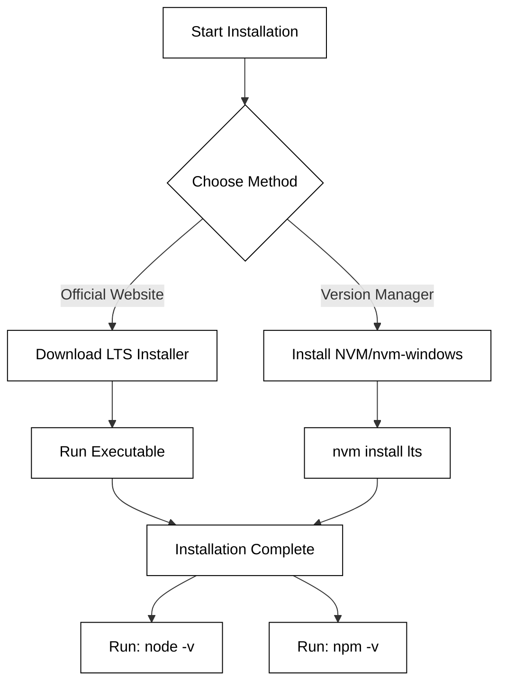

# Node web service

With JavaScript we can write code that listens on a network port (e.g. 80, 443, 3000, or 8080), receives HTTP requests, processes them, and then responds. We can use this to create a simple web service that we then execute using Node.js.

## Installing Node.js and NPM

NPM (Node Package Manager) is the world's largest software registry and the default package manager for the Node.js runtime environment. It consists of a command-line client that allows developers to install, share, and manage dependencies for their web services. Because NPM is deeply integrated with the Node.js ecosystem, it is bundled directly with the Node.js installer. When you install Node.js, you automatically get NPM installed on your system.

For a professional development environment, there are two primary ways to install Node.js and NPM:

1.  **The Official Installer:** You can download the installer for Windows, macOS, or Linux directly from the [Node.js website](https://nodejs.org/). It is highly recommended to choose the **LTS (Long Term Support)** version, as it provides the most stability for web services.
2.  **Node Version Manager (NVM):** This is the preferred method for many developers. NVM allows you to install multiple versions of Node.js on the same machine and switch between them easily. This is particularly useful when maintaining different projects that require different Node.js versions.

The following diagram illustrates the typical installation and verification workflow:



Once the installation is complete, you must verify that both the runtime and the package manager are correctly configured in your system's PATH. Open your terminal or command prompt and execute the following commands:

```bash
# Check the version of Node.js installed
node -v

# Check the version of NPM installed
npm -v
```

If the installation was successful, these commands will output version numbers (e.g., `v20.11.0` and `10.2.4`). If you receive a "command not found" error, you may need to restart your terminal or manually add the installation directory to your environment variables.

### Key Considerations
*   **Permissions:** On macOS and Linux, avoid using `sudo` to install global packages. Using NVM helps prevent permission issues by installing Node in your user directory.
*   **Updates:** NPM is updated more frequently than Node.js. You can update NPM to the latest version independently by running `npm install -g npm@latest`.
*   **LTS vs. Current:** Always prioritize **LTS** for production web services to ensure you receive security patches without breaking changes.

```masteryls
{"id":"npm-install-001", "title":"Identifying the NPM Installation Process", "type":"multiple-choice"}
What is the most common way to install NPM on a local development machine?

- [ ] NPM must be downloaded as a separate standalone executable from npmjs.com
- [x] NPM is automatically bundled and installed when you install Node.js
- [ ] NPM is a built-in feature of modern web browsers like Chrome and Firefox
- [ ] NPM must be compiled from source code using a C++ compiler
```

Next create your project.

```sh
➜ mkdir webservicetest
➜ cd webservicetest
➜ npm init -y
```

Now, open VS Code and create a file named `index.js`. Paste the following code into the file and save.

```js
const http = require('http');
const server = http.createServer(function (req, res) {
  res.writeHead(200, { 'Content-Type': 'text/html' });
  res.write(`<h1>Hello Node.js! [${req.method}] ${req.url}</h1>`);
  res.end();
});

server.listen(8080, () => {
  console.log(`Web service listening on port 8080`);
});
```

This code uses the Node.js built-in `http` package to create our HTTP server using the `http.createServer` function along with a callback function that takes a request (`req`) and response (`res`) object. That function is called whenever the server receives an HTTP request. In our example, the callback always returns the same HTML snippet, with a status code of 200, and a Content-Type header, no matter what request is made. Basically this is just a simple dynamically generated HTML page. A real web service would examine the HTTP path and return meaningful content based upon the purpose of the endpoint.

The `server.listen` call starts listening on port 8080 and blocks until the program is terminated.

We execute the program by going back to our console window and running Node.js to execute our index.js file. If the service starts up correctly then it should look like the following.

```sh
➜ node index.js
Web service listening on port 8080
```

You can now open your browser and point it to `localhost:8080` and view the result. The interaction between the JavaScript, node, and the browser looks like this.


Use different URL paths in the browser and note that it will echo the HTTP method and path back in the document. You can kill the process by pressing `CTRL-C` in the console.

Note that you can also start up Node and execute the `index.js` code directly in VS Code. To do this open index.js in VS Code and press the 'F5' key. This should ask you what program you want to run. Select `node.js`. This starts up Node.js with the `index.js` file, but also attaches a debugger so that you can set breakpoints in the code and step through each line of code.

> [!NOTE]
>
> Make sure you complete the above steps. For the rest of the course you will be executing your code using Node.js to run your backend code and serve up your frontend code to the browser. This means you will no longer be using the `VS Code Live Server extension` to serve your frontend code in the browser.
